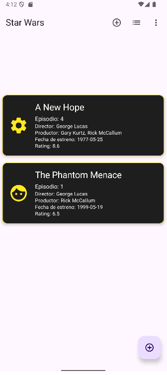
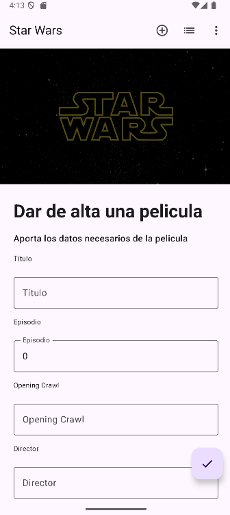
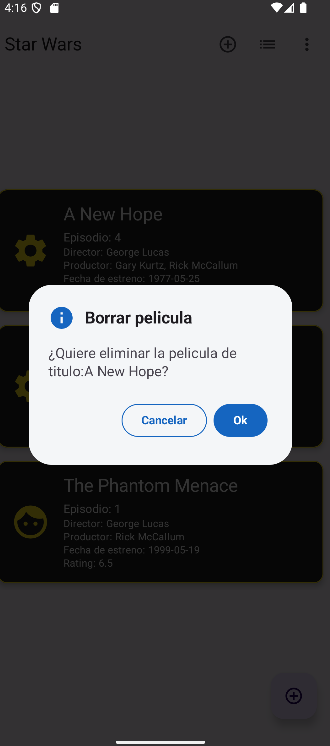
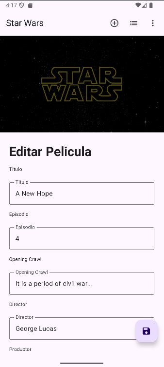
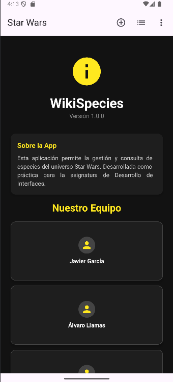

# Start Wars App ⭐

Aplicación Android desarrollada con **Kotlin y Jetpack Compose** para la gestión de películas de Star Wars.  
La aplicación permite **listar, añadir, editar y eliminar películas**, además de incluir una pantalla informativa **About Us**.  

---

## Funcionalidades de la aplicación

### Listar
La pantalla de listado muestra todas las películas almacenadas en la aplicación mediante un `LazyColumn`.  
Cada elemento presenta información relevante como el título, episodio, director, productor, fecha de estreno y el rating de la misma.

Interacciones disponibles:
- Pulsación corta sobre un elemento: navegación a la pantalla de **Editar**.
- Pulsación larga sobre un elemento: aparicion de un diálogo de confirmación para **Eliminar**.

---

### Añadir
La pantalla de añadir permite crear una nueva película mediante un formulario.  
Al guardar una película:
- Se generan automáticamente los campos de fecha de creación y edición.
- La película se añade al repositorio.

---

### Eliminar
La eliminación de una película se realiza desde el listado mediante una pulsación larga.

Funcionamiento de la accion eliminar:
1. El usuario realiza una pulsación larga sobre una película.
2. Se muestra un **AlertDialog** de confirmación.
3. Al confirmar, la película se elimina del repositorio.
4. Se muestra un **SnackBar**, informando al usuario del resultado de la acción.

---

### Editar
La pantalla de edición permite modificar una película existente.

Funcionamiento de la accion eliminar:
1. Al estar en la pantalla de listar, se hara una pulsacion corta
2. Tras la pulsacion se mostrara el formulario para editar la pelicula
3. Tras presionar el boton de guardar, ya seran visibles los cambios

---

### About Us
La pantalla **About Us** muestra información general sobre la aplicación y del equipo desarrollador.

---

## Tecnologías utilizadas

- Kotlin
- Jetpack Compose
- Accompanist Navigation Animation
- Hilt

